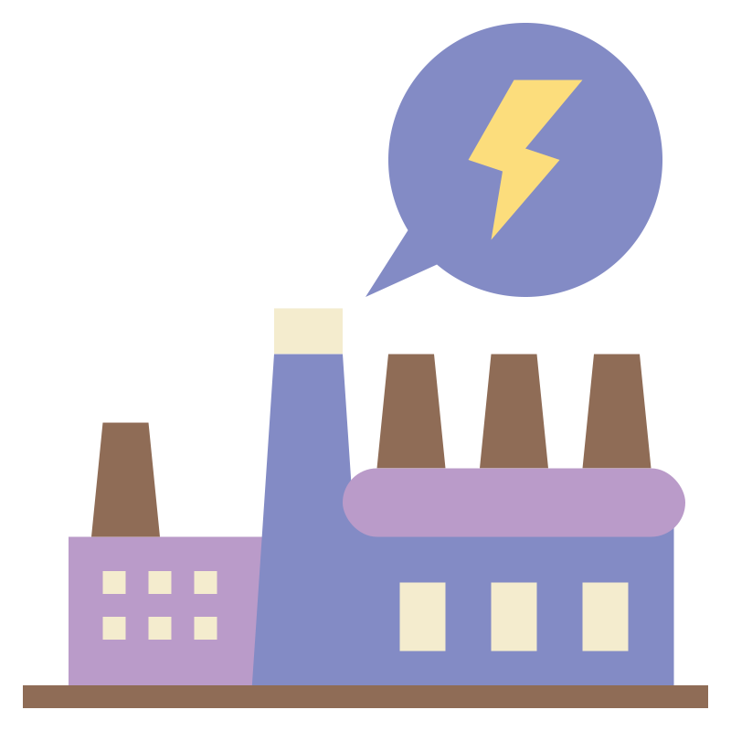
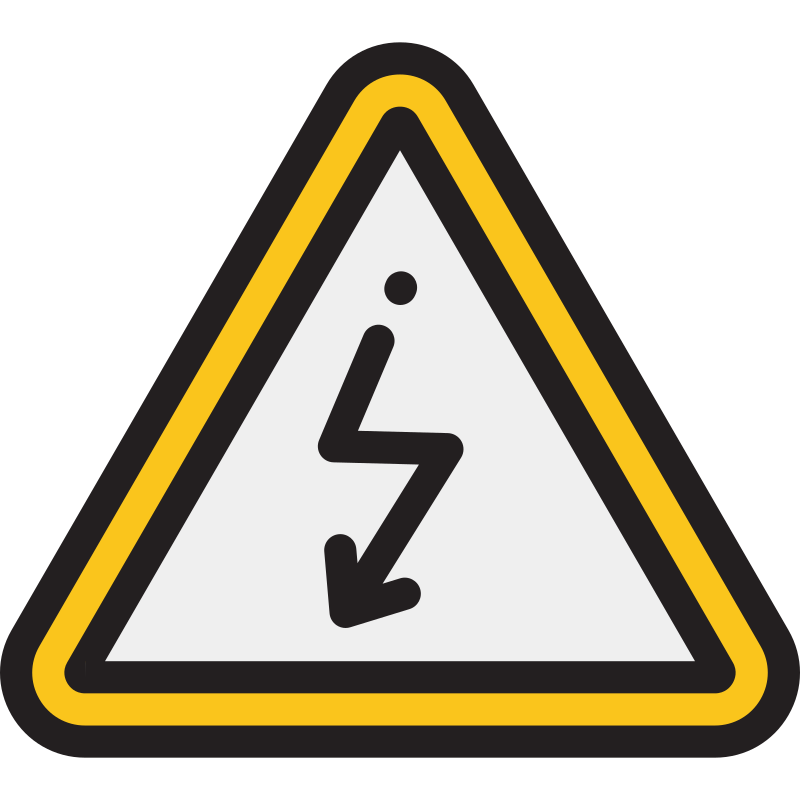
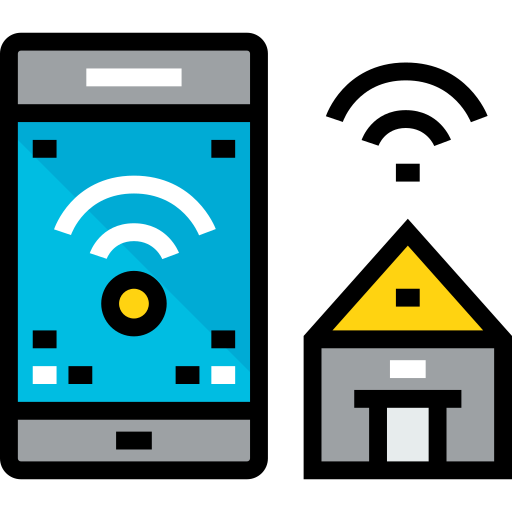
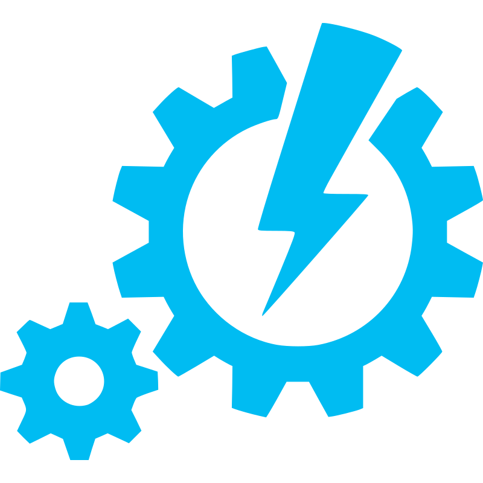

<!--

  
  
  

-->

<!-- WEATHER:START -->
🌤 Good Afternoon from **Shiraz** — **12°C**, ☀️ Clear · 💨 21 km/h (SSE)
<!-- WEATHER:END -->

## Computer Science
  

### Programming Languages

  
  
  
  
  
  

### Technical Languages
<!-- Technical Languages -->

<table>
  <tr>
    <td align="center" style="padding:0 14px;">
       
      <b>VHDL</b>
    </td>
    <td align="center" style="padding:0 14px;">
       
      <b>Matlab</b>
    </td>
    <td align="center" style="padding:0 14px;">
       
      <b>Ladder</b>
    </td>
    <td align="center" style="padding:0 14px;">
       
      <b>FBD</b>
    </td>
  </tr>
</table>

### Databases

### Game Engines

  
  

### Frameworks

<!-- Python Section -->
  
 
 
 
 
 

<!-- JavaScript Section -->
  
 
 

<!-- Styling Section -->
  
 

### Tools & Environments

**IDEs & Editors:**&nbsp;&nbsp; 
 

**Version Control / DevOps:**&nbsp;&nbsp; 
 
 

**Simulation / Design / Embedded:**  
 
 
 
 
 

### Skills:

<!-- Soft / Professional Skills -->

<!-- Computer Science Concepts -->

<!-- Electrical / Robotics Concepts -->

<!-- Other Skills / Hobbies -->

## Electronics & Electrical Engineering:

<table>
  <tr>
    <td align="center" style="padding:0 18px;">
      
    </td>
    <td align="center" style="padding:0 18px;">
      
    </td>
    <td align="center" style="padding:0 18px;">
      
    </td>
    <td align="center" style="padding:0 18px;">
      
    </td>
    <td align="center" style="padding:0 18px;">
      
    </td>
  </tr>
  <tr>
    <td align="center"></td>
    <td align="center"></td>
    <td align="center"></td>
    <td align="center"></td>
    <td align="center"></td>
  </tr>
</table>

## Personal

### Currently Learning

### Hobbies
#### 📊 Anilist Stats
<!-- ANILIST:START -->

### 🎬 Anime Statistics

| Metric | Value |
|---|---:|
| Count | 514 |
| Episodes watched | 13,012 |
| ~Days watched | 221.8 |
| Mean score | 73.61 |

### 📚 Manga Statistics

| Metric | Value |
|---|---:|
| Count | 39 |
| Chapters read | 9,663 |
| Volumes read | 651 |
| Mean score | 81.38 |

<!-- ANILIST:END -->

### 🎮 Games I Love

  
  <!--  -->
  
  

### 📬 How to Contact Me

  
  &nbsp;&nbsp;
  

## 📊 GitHub Stats

### 📌 Pinned Projects

