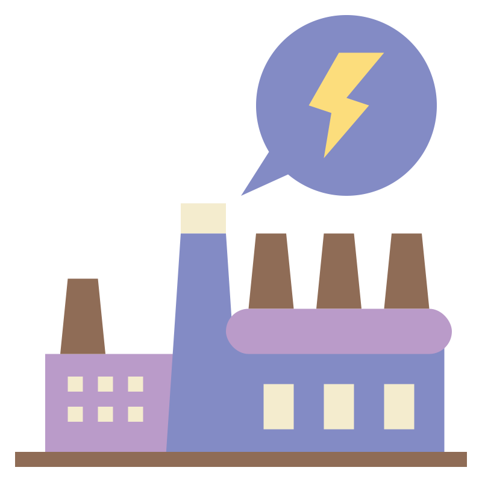

  
  
  
  
  
  
  

## Computer Science

### programming languages

  
  
  
  
  
  

### technical lnaguages

  
     
    VHDL
  
  
     
    Matlab
  
  
     
    ladder
  
  
     
    FBD
  

### databases

### Game Enginges

  
  

### Frameworks

<!-- Python Section -->
  
 
 
 
 
 

<!-- JavaScript Section -->
  
 
 

<!-- Styling Section -->
  
 

### Tools & Environments

**IDEs & Editors:**&nbsp;&nbsp; 
 

**Version Control / DevOps:**&nbsp;&nbsp; 
 
 

**Simulation / Design / Embedded:**&nbsp;&nbsp; 
 
 

### Skills

## Electronics & Electrical Engineering

  
  **analog and IP(digital) CCTV**
  
   **Industrial Electricity**
  
   **House Electricity**
  
   **Smart Home**
  
   **Industrial Automation**: PLC programming and VHDL for FPGA designs.
  

## Personal

### curently learning

### Hobbies

### social media 

### how to contact me

### anime stats + anilist link

## stats 
### pinned project
### stats card